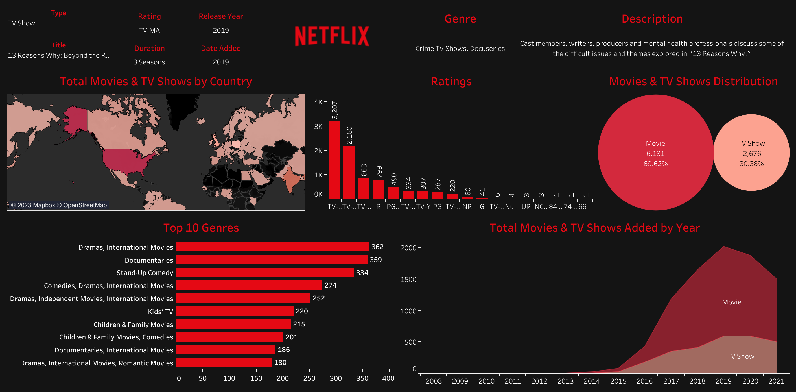

# Netflix Movies & TV Shows Dashboard

## Overview

Netflix is an American subscription video on-demand over-the-top streaming service owned and operated by Netflix, Inc. The service primarily distributes films and television series produced by the media company of the same name from various genres, and it is available in multiple languages.

## Insights

- By the year 2021, Netflix has added 6,313 Movies, which make up about 70% of the content on Netflix, while the TV Shows reached a count of 2,676.
- The United States, India, and Japan are the countries that produce the most titles.
- The highest release of Movies was in 2019 with a count of 1,424 while the peak for TV Shows was in 2020 with a count of 595. But both started dropping which I believe was due to COVID-19.
- Most of the genres for both Movies & TV Shows added on Netflix are "Dramas, International Movies", "Documentaries", "Stand-Up Comedy", "Kids TV" and "Family Movies".
- Most ratings of the titles on Netflix are of the "TV-MA", "TV-14", "TV-PG", and "R".

## Visualization

Tableau: [Netflix Movies & TV Shows Dashboard](https://public.tableau.com/app/profile/ahmed6065/viz/NetflixDashboard_16885955096230/Netflix?publish=yes)

